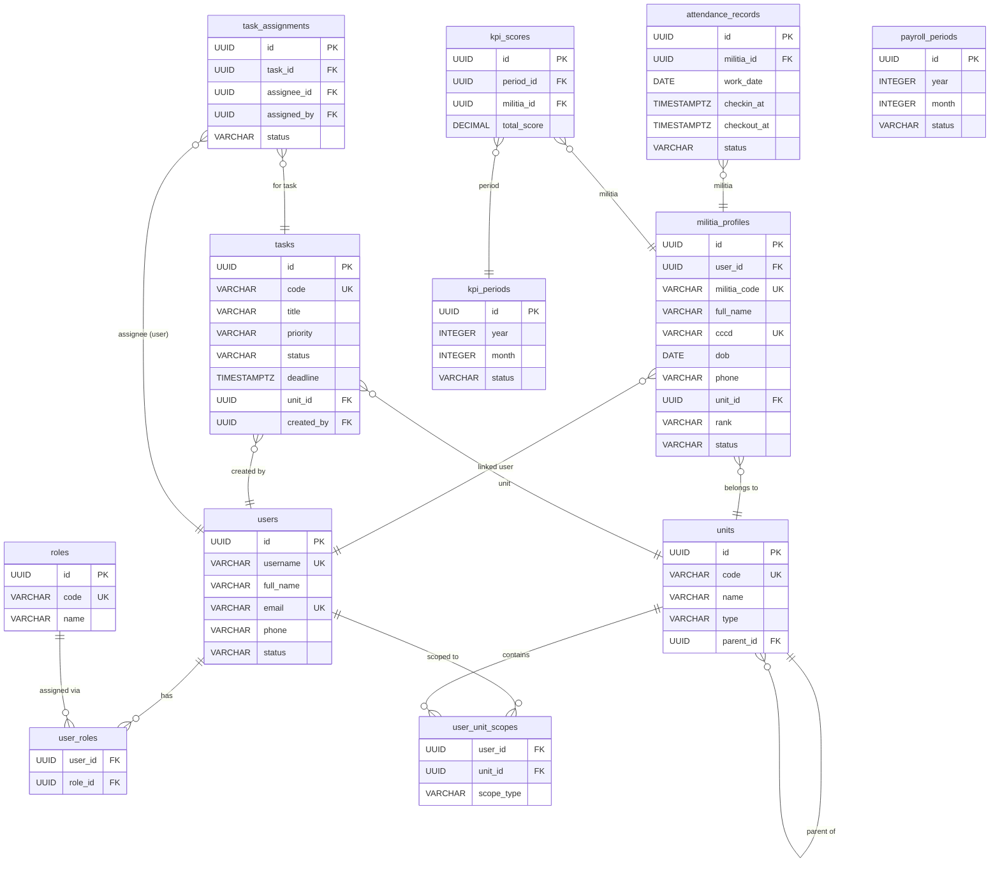

# ERD — Smart Select Feature (Relevant Tables)
Task ID: TASK-SS-2026-001 | Version: v1.0 | Date: 2026-03-08

---

## TABLES IN SCOPE

### militia_profiles
Primary entity for SmartSelect in task/attendance/payroll/GPS screens.

| Column | Type | Constraint | Notes |
|---|---|---|---|
| `id` | UUID PK | DEFAULT gen_random_uuid() | SmartSelect value |
| `user_id` | UUID FK→users.id | ON DELETE SET NULL, nullable | Must not be null when assigning task |
| `militia_code` | VARCHAR(50) | UNIQUE NOT NULL | Search field — exact/prefix match |
| `full_name` | VARCHAR(255) | NOT NULL | Search field — unaccent ILIKE |
| `cccd` | VARCHAR(12) | UNIQUE NOT NULL | Search field |
| `dob` | DATE | NOT NULL | |
| `gender` | VARCHAR(10) | CHECK(male/female/other) | |
| `phone` | VARCHAR(20) | nullable | Search field |
| `address` | TEXT | nullable | |
| `unit_id` | UUID FK→units.id | ON DELETE RESTRICT NOT NULL | FK filter context |
| `position` | VARCHAR(100) | nullable | |
| `rank` | VARCHAR(50) | nullable | Sublabel in SmartSelect |
| `join_date` | DATE | NOT NULL | |
| `status` | VARCHAR(20) | CHECK(active/inactive/transferred/retired) | Filter: only active in search |
| `created_at` | TIMESTAMPTZ | NOT NULL DEFAULT NOW() | |
| `updated_at` | TIMESTAMPTZ | NOT NULL DEFAULT NOW() | |

**Indexes:** `idx_militia_profiles_code`, `idx_militia_profiles_unit`, `idx_militia_profiles_status`
**Additional index for search (to create):** `CREATE INDEX idx_militia_profiles_fullname ON militia_profiles (lower(full_name));`

---

### units
Hierarchical organization (ward → area). Context filter source.

| Column | Type | Constraint | Notes |
|---|---|---|---|
| `id` | UUID PK | | |
| `code` | VARCHAR(50) | UNIQUE NOT NULL | Used as unitScope value |
| `name` | VARCHAR(255) | NOT NULL | Sublabel in unit SmartSelect |
| `type` | VARCHAR(50) | CHECK(ward/area/district/province) | |
| `parent_id` | UUID FK→units.id | ON DELETE SET NULL, nullable | Hierarchical |
| `address` | TEXT | nullable | |
| `latitude` | DECIMAL(10,8) | nullable | |
| `longitude` | DECIMAL(11,8) | nullable | |
| `created_at` | TIMESTAMPTZ | | |
| `updated_at` | TIMESTAMPTZ | | |

---

### users
User accounts — task_assignments.assignee_id points here.

| Column | Type | Constraint | Notes |
|---|---|---|---|
| `id` | UUID PK | | |
| `username` | VARCHAR(50) | UNIQUE NOT NULL | Search field |
| `password_hash` | VARCHAR(255) | NOT NULL, select:false | |
| `full_name` | VARCHAR(255) | NOT NULL | Search field |
| `email` | VARCHAR(255) | UNIQUE, nullable | |
| `phone` | VARCHAR(20) | nullable | |
| `status` | VARCHAR(20) | CHECK(active/inactive/suspended/pending) | Filter: active only |
| `created_at` | TIMESTAMPTZ | | |
| `updated_at` | TIMESTAMPTZ | | |

**Virtual fields** (resolved via joins):
- `role` ← `user_roles` → `roles.code`
- `unitScope` ← `user_unit_scopes` → `units.code`

---

### tasks
Task records — assigned via task_assignments.

| Column | Type | Constraint | Notes |
|---|---|---|---|
| `id` | UUID PK | | |
| `code` | VARCHAR(50) | UNIQUE NOT NULL | e.g. TASK-2026-001 |
| `title` | VARCHAR(255) | NOT NULL | |
| `description` | TEXT | nullable | |
| `type` | VARCHAR(50) | CHECK(patrol/guard/inspection/support/training/admin/other) | |
| `priority` | VARCHAR(20) | CHECK(urgent/high/medium/low) | SmartSelect static |
| `status` | VARCHAR(20) | CHECK(pending/assigned/in_progress/completed/cancelled/overdue) | |
| `deadline` | TIMESTAMPTZ | nullable | |
| `unit_id` | UUID FK→units.id | ON DELETE SET NULL | |
| `created_by` | UUID FK→users.id | NOT NULL ON DELETE RESTRICT | |
| `created_at` | TIMESTAMPTZ | | |
| `updated_at` | TIMESTAMPTZ | | |

---

### task_assignments
Junction: task ↔ assignee (user).

| Column | Type | Constraint | Notes |
|---|---|---|---|
| `id` | UUID PK | | |
| `task_id` | UUID FK→tasks.id | NOT NULL ON DELETE CASCADE | |
| `assignee_id` | UUID FK→users.id | NOT NULL ON DELETE CASCADE | ← FK to users, NOT militia_profiles |
| `assigned_by` | UUID FK→users.id | NOT NULL ON DELETE RESTRICT | |
| `status` | VARCHAR(20) | CHECK(assigned/accepted/rejected/in_progress/completed) | |
| `assigned_at` | TIMESTAMPTZ | NOT NULL DEFAULT NOW() | |
| `note` | TEXT | nullable | |
| UNIQUE | (task_id, assignee_id) | | |

**⚠️ SCHEMA DELTA NOTE:**
- `assignee_id` → `users.id` in DB
- Business intent: assign to militia_profiles
- **Resolution:** `militia_profiles.user_id` serves as bridge; service maps militia→user
- Guard: militia must have `user_id IS NOT NULL`

---

### attendance_records
Attendance per militia per date.

| Column | Type | Constraint | Notes |
|---|---|---|---|
| `id` | UUID PK | | |
| `militia_id` | UUID FK→militia_profiles.id | NOT NULL ON DELETE CASCADE | SmartSelect value |
| `task_id` | UUID FK→tasks.id | ON DELETE SET NULL, nullable | |
| `work_date` | DATE | NOT NULL | |
| `checkin_at` | TIMESTAMPTZ | nullable | |
| `checkout_at` | TIMESTAMPTZ | nullable | |
| `source` | VARCHAR(20) | CHECK(mobile/web/manual) | |
| `status` | VARCHAR(20) | CHECK(checked_in/checked_out/late/early_leave/absent) | SmartSelect static |
| `work_hours` | DECIMAL(5,2) | nullable | |
| `note` | TEXT | nullable | |
| UNIQUE | (militia_id, work_date) | | Prevents duplicate |

---

### kpi_periods
KPI tracking periods — SmartSelect in payroll screens.

| Column | Type | Constraint | Notes |
|---|---|---|---|
| `id` | UUID PK | | SmartSelect value |
| `year` | INTEGER | NOT NULL | |
| `month` | INTEGER | CHECK(1–12) | |
| `status` | VARCHAR(20) | CHECK(open/closed/locked) | |
| UNIQUE | (year, month) | | |

---

### payroll_periods
Payroll periods — SmartSelect in payroll screens.

| Column | Type | Constraint | Notes |
|---|---|---|---|
| `id` | UUID PK | | SmartSelect value |
| `year` | INTEGER | NOT NULL | |
| `month` | INTEGER | CHECK(1–12) | |
| `status` | VARCHAR(20) | CHECK(draft/processing/approved/paid) | |
| UNIQUE | (year, month) | | |

---

## MERMAID DIAGRAM

---

## FK RELATIONSHIPS RELEVANT TO SMARTSELECT

| SmartSelect Field | Form | FK → Table | Search API |
|---|---|---|---|
| `assigneeId` | TaskCreateForm | militia_profiles (→ users via mapping) | GET /militia/search |
| `militiaId` | AttendanceForm | militia_profiles | GET /militia/search |
| `periodId` | AttendanceForm | kpi_periods (attendance_records doesn't have period — maps to work_date month) | GET /attendance/periods |
| `militiaId` | PayrollKpiFilter | militia_profiles | GET /militia/search |
| `periodId` | PayrollKpiFilter | kpi_periods | GET /payroll/periods |
| `role` | UserForm | roles.code (static enum) | Static options |
| `unitScope` | UserForm | units.code (static) | Static options |
| `priority` | TaskCreateForm | enum (static) | Static options |
| `status` | AttendanceForm | enum (static) | Static options |

---

## MIGRATION ORDER

| # | File | Tables Created |
|---|---|---|
| 001 | `001_identity_access.sql` | users, roles, permissions, units, user_roles, role_permissions, user_unit_scopes |
| 002 | `002_personnel.sql` | militia_profiles, police_profiles |
| 003 | `003_tasks.sql` | files, tasks, task_assignments, task_updates, task_evidences |
| 004 | `004_attendance_gps.sql` | attendance_records, gps_points, gps_latest |
| 005 | `005_leave_approvals.sql` | leave_types, leave_requests, leave_approvals, leave_balances |
| 006 | `006_kpi_payroll.sql` | kpi_periods, kpi_scores, kpi_criteria, payroll_periods, payroll_items |
| 007 | `007_alerts_notifications_security.sql` | incidents, alerts, notifications, notification_receipts, devices, sessions, device_tokens |
| 008 | `008_platform.sql` | audit_logs, outbox_events, system_settings |
| NEW | (run manually) | `CREATE EXTENSION IF NOT EXISTS unaccent;` |
