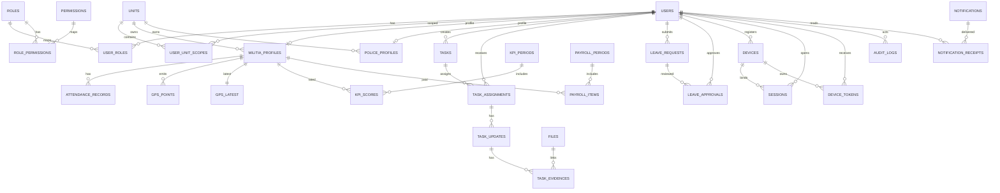

# ERD
Task ID: TASK-2026-001
Database: PostgreSQL 18 (`MMS_Core`)

## Tables and constraints

### Identity and access
- `users(id PK, username UNIQUE, password_hash, full_name, email UNIQUE, status, created_at, updated_at)`
- `roles(id PK, code UNIQUE, name)`
- `permissions(id PK, code UNIQUE, name)`
- `user_roles(user_id FK->users.id, role_id FK->roles.id, PRIMARY KEY(user_id, role_id))`
- `role_permissions(role_id FK->roles.id, permission_id FK->permissions.id, PRIMARY KEY(role_id, permission_id))`
- `units(id PK, code UNIQUE, name, parent_id FK->units.id)`
- `user_unit_scopes(user_id FK->users.id, unit_id FK->units.id, scope_type, PRIMARY KEY(user_id, unit_id, scope_type))`

### Personnel
- `militia_profiles(id PK, user_id FK->users.id NULL, militia_code UNIQUE, full_name, cccd UNIQUE, dob, unit_id FK->units.id, status)`
- `police_profiles(id PK, user_id FK->users.id, badge_no UNIQUE, unit_id FK->units.id, rank)`

### Task operations
- `tasks(id PK, code UNIQUE, title, type, priority, status, deadline, created_by FK->users.id, unit_id FK->units.id)`
- `task_assignments(id PK, task_id FK->tasks.id, assignee_id FK->users.id, assigned_by FK->users.id, status, assigned_at)`
- `task_updates(id PK, task_assignment_id FK->task_assignments.id, progress, note, updated_by FK->users.id, updated_at)`
- `task_evidences(id PK, task_update_id FK->task_updates.id, file_id FK->files.id, evidence_type)`

### Attendance and GPS
- `attendance_records(id PK, militia_id FK->militia_profiles.id, task_id FK->tasks.id NULL, checkin_at, checkout_at, checkin_lat, checkin_lng, checkout_lat, checkout_lng, accuracy, source)`
- `gps_points(id PK, militia_id FK->militia_profiles.id, lat, lng, accuracy, battery, signal, captured_at)`
- `gps_latest(militia_id PK FK->militia_profiles.id, lat, lng, accuracy, battery, signal, last_seen_at, status)`

### Leave and approvals
- `leave_requests(id PK, requester_id FK->users.id, from_date, to_date, reason, status, created_at)`
- `leave_approvals(id PK, leave_request_id FK->leave_requests.id, approver_id FK->users.id, action, reason, acted_at)`

### KPI and payroll
- `kpi_periods(id PK, year, month, status, rule_version)`
- `kpi_scores(id PK, period_id FK->kpi_periods.id, militia_id FK->militia_profiles.id, attendance_score, task_score, discipline_score, total_score)`
- `payroll_periods(id PK, year, month, status)`
- `payroll_items(id PK, payroll_period_id FK->payroll_periods.id, militia_id FK->militia_profiles.id, base_salary, allowance, bonus, deduction, net_salary, approval_status)`

### Alerts, notifications, security
- `incidents(id PK, reporter_id FK->users.id, severity, message, lat, lng, status, created_at)`
- `alerts(id PK, category, severity, title, message, related_entity_type, related_entity_id, status, created_at, resolved_at)`
- `notifications(id PK, type, title, body, payload_json, created_at)`
- `notification_receipts(id PK, notification_id FK->notifications.id, user_id FK->users.id, delivered_at, read_at)`
- `devices(id PK, user_id FK->users.id, device_name, fingerprint UNIQUE, platform, app_version, os_version, status, trusted, last_seen_at)`
- `sessions(id PK, user_id FK->users.id, device_id FK->devices.id NULL, refresh_token_hash, expires_at, revoked_at, ip, user_agent)`
- `device_tokens(id PK, user_id FK->users.id, device_id FK->devices.id, push_token, platform, active, updated_at)`

### Platform
- `files(id PK, storage_key, mime_type, size, checksum, uploaded_by FK->users.id, created_at)`
- `audit_logs(id PK, actor_id FK->users.id, action, entity_type, entity_id, before_json, after_json, ip, user_agent, created_at)`
- `outbox_events(id PK, event_type, payload_json, status, created_at, published_at)`

## Mermaid diagram

## Migration order
1. `users`, `roles`, `permissions`, `units`
2. `user_roles`, `role_permissions`, `user_unit_scopes`
3. `militia_profiles`, `police_profiles`
4. `files`, `tasks`, `task_assignments`, `task_updates`, `task_evidences`
5. `attendance_records`, `gps_points`, `gps_latest`
6. `leave_requests`, `leave_approvals`
7. `kpi_periods`, `kpi_scores`, `payroll_periods`, `payroll_items`
8. `incidents`, `alerts`, `notifications`, `notification_receipts`
9. `devices`, `sessions`, `device_tokens`
10. `audit_logs`, `outbox_events`
